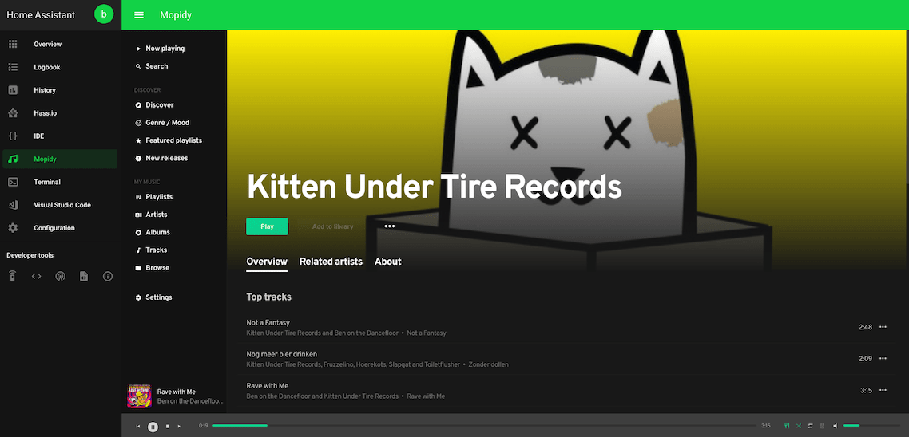

# Home Assistant Community Add-on: Mopidy

[![GitHub Release][releases-shield]][releases]
![Project Stage][project-stage-shield]
[![License][license-shield]](LICENSE.md)

[![GitLab CI][gitlabci-shield]][gitlabci]
![Project Maintenance][maintenance-shield]
[![GitHub Activity][commits-shield]][commits]

[![Discord][discord-shield]][discord]
[![Community Forum][forum-shield]][forum]

[![Sponsor Frenck via GitHub Sponsors][github-sponsors-shield]][github-sponsors]

[![Support Frenck on Patreon][patreon-shield]][patreon]



Mopidy is an extensible music server.

## About

Mopidy plays music from local disk, Youtube, Spotify, SoundCloud, Google Play Music,
and more. You edit the playlist from any phone, tablet, or computer using a
range of MPD and web clients.

## Installation

The installation of this add-on is pretty straightforward and not different in
comparison to installing any other Home Assistant add-on.

1. Search for the "Mopidy" add-on in the Home Assistant add-on store
   and install it.
1. Install the "Mopidy" add-on.
1. Start the "Mopidy" add-on.
1. Check the logs of the "Mopidy" add-on to see if everything went well.

## Configuration

**Note**: _Remember to restart the add-on when the configuration is changed._

Example add-on configuration:

```yaml
settings:
  - name: soundcloud/auth_token
    value: 1-1111-1111-11eeaswdf23
  - name: spotify/username
    value: your@email.com
  - name: spotify/password
    value: thesupersecretpassword
  - name: spotify/client_id
    value: spotify-client-id
  - name: spotify/client_secret
    value: spotify-client-secret=
  - name: gmusic/username
    value: username
  - name: gmusic/password
    value: thesupersecretpassword
  - name: gmusic/deviceid
    value: yodeviceid
  - name: youtube/enabled
    value: 'true'
  - name: file/enabled
    value: 'true'
  - name: file/media_dirs
    value: /share/mopidy/media
system_packages: []
python_packages: []
```

### Option: `settings`

This option allows you to tweak every aspect of Mopidy by setting
configuration options. See the example at the start of this chapter
to get an idea of how the configuration looks.

For more information about using these settings, see the official Mopidy
documentation:

<https://docs.mopidy.com/en/latest/config/>

**Note**: _This option support secrets, e.g., `!secret spotify_password`._

### Option: `system_packages`

Allows you to specify additional [Ubuntu packages][ubuntu-packages] to be
installed in your shell environment (e.g., Python, PHP, Go).

**Note**: _Adding many packages will result in a longer start-up
time for the add-on._

### Option: `python_packages`

Allows you to specify additional [Python packages][python-packages] to be
installed to your Mopidy setup (e.g., `PyMySQL`. `Requests`, `Pillow`).

**Note**: _Adding many packages will result in a longer start-up time
for the add-on._

### Option: `leave_front_door_open`

Adding this option to the add-on configuration allows you to disable
authentication on the VSCode by setting it to `true`.

**Note**: _We STRONGLY suggest, not to use this, even if this add-on is
only exposed to your internal network. USE AT YOUR OWN RISK!_

## Changelog & Releases

This repository keeps a change log using [GitHub's releases][releases]
functionality. The format of the log is based on
[Keep a Changelog][keepchangelog].

Releases are based on [Semantic Versioning][semver], and use the format
of ``MAJOR.MINOR.PATCH``. In a nutshell, the version will be incremented
based on the following:

- ``MAJOR``: Incompatible or major changes.
- ``MINOR``: Backwards-compatible new features and enhancements.
- ``PATCH``: Backwards-compatible bugfixes and package updates.

## Support

Got questions?

You have several options to get them answered:

- The [Home Assistant Community Add-ons Discord chat server][discord] for add-on
  support and feature requests.
- The [Home Assistant Discord chat server][discord-ha] for general Home
  Assistant discussions and questions.
- The Home Assistant [Community Forum][forum].
- Join the [Reddit subreddit][reddit] in [/r/homeassistant][reddit]

You could also [open an issue here][issue] GitHub.

## Contributing

This is an active open-source project. We are always open to people who want to
use the code or contribute to it.

We have set up a separate document containing our
[contribution guidelines](CONTRIBUTING.md).

Thank you for being involved! :heart_eyes:

## Authors & contributors

The original setup of this repository is by [Bram Mittendorff][brammittendorff],
[Franck Nijhof][frenck] and [Robbert Müller][mjrider].

For a full list of all authors and contributors,
check [the contributor's page][contributors].

## We have got some Home Assistant add-ons for you

Want some more functionality to your Home Assistant instance?

We have created multiple add-ons for Home Assistant. For a full list, check out
our [GitHub Repository][repository].

## License

MIT License

Copyright (c) 2019-2020 Bram Mittendorff, Franck Nijhof, Robbert Müller

Permission is hereby granted, free of charge, to any person obtaining a copy
of this software and associated documentation files (the "Software"), to deal
in the Software without restriction, including without limitation the rights
to use, copy, modify, merge, publish, distribute, sublicense, and/or sell
copies of the Software, and to permit persons to whom the Software is
furnished to do so, subject to the following conditions:

The above copyright notice and this permission notice shall be included in all
copies or substantial portions of the Software.

THE SOFTWARE IS PROVIDED "AS IS", WITHOUT WARRANTY OF ANY KIND, EXPRESS OR
IMPLIED, INCLUDING BUT NOT LIMITED TO THE WARRANTIES OF MERCHANTABILITY,
FITNESS FOR A PARTICULAR PURPOSE AND NONINFRINGEMENT. IN NO EVENT SHALL THE
AUTHORS OR COPYRIGHT HOLDERS BE LIABLE FOR ANY CLAIM, DAMAGES OR OTHER
LIABILITY, WHETHER IN AN ACTION OF CONTRACT, TORT OR OTHERWISE, ARISING FROM,
OUT OF OR IN CONNECTION WITH THE SOFTWARE OR THE USE OR OTHER DEALINGS IN THE
SOFTWARE.

[brammittendorff]: https://github.com/brammittendorff
[github-sponsors-shield]: https://frenck.dev/wp-content/uploads/2019/12/github_sponsor.png
[github-sponsors]: https://github.com/sponsors/frenck
[commits-shield]: https://img.shields.io/github/commit-activity/y/hassio-addons/addon-mopidy.svg
[commits]: https://github.com/hassio-addons/addon-mopidy/commits/master
[contributors]: https://github.com/hassio-addons/addon-mopidy/graphs/contributors
[discord-ha]: https://discord.gg/c5DvZ4e
[discord-shield]: https://img.shields.io/discord/478094546522079232.svg
[discord]: https://discord.me/hassioaddons
[forum-shield]: https://img.shields.io/badge/community-forum-brightgreen.svg
[forum]: https://community.home-assistant.io/?u=frenck
[frenck]: https://github.com/frenck
[gitlabci-shield]: https://gitlab.com/hassio-addons/addon-mopidy/badges/master/pipeline.svg
[gitlabci]: https://gitlab.com/hassio-addons/addon-mopidy/pipelines
[home-assistant]: https://home-assistant.io
[issue]: https://github.com/hassio-addons/addon-mopidy/issues
[keepchangelog]: http://keepachangelog.com/en/1.0.0/
[license-shield]: https://img.shields.io/github/license/hassio-addons/addon-mopidy.svg
[maintenance-shield]: https://img.shields.io/maintenance/yes/2020.svg
[mjrider]: https://github.com/mjrider
[patreon-shield]: https://frenck.dev/wp-content/uploads/2019/12/patreon.png
[patreon]: https://www.patreon.com/frenck
[project-stage-shield]: https://img.shields.io/badge/project%20stage-experimental-yellow.svg
[python-packages]: https://pypi.org
[reddit]: https://reddit.com/r/homeassistant
[releases-shield]: https://img.shields.io/github/release/hassio-addons/addon-mopidy.svg
[releases]: https://github.com/hassio-addons/addon-mopidy/releases
[repository]: https://github.com/hassio-addons/repository
[semver]: http://semver.org/spec/v2.0.0
[ubuntu-packages]: https://packages.ubuntu.com
